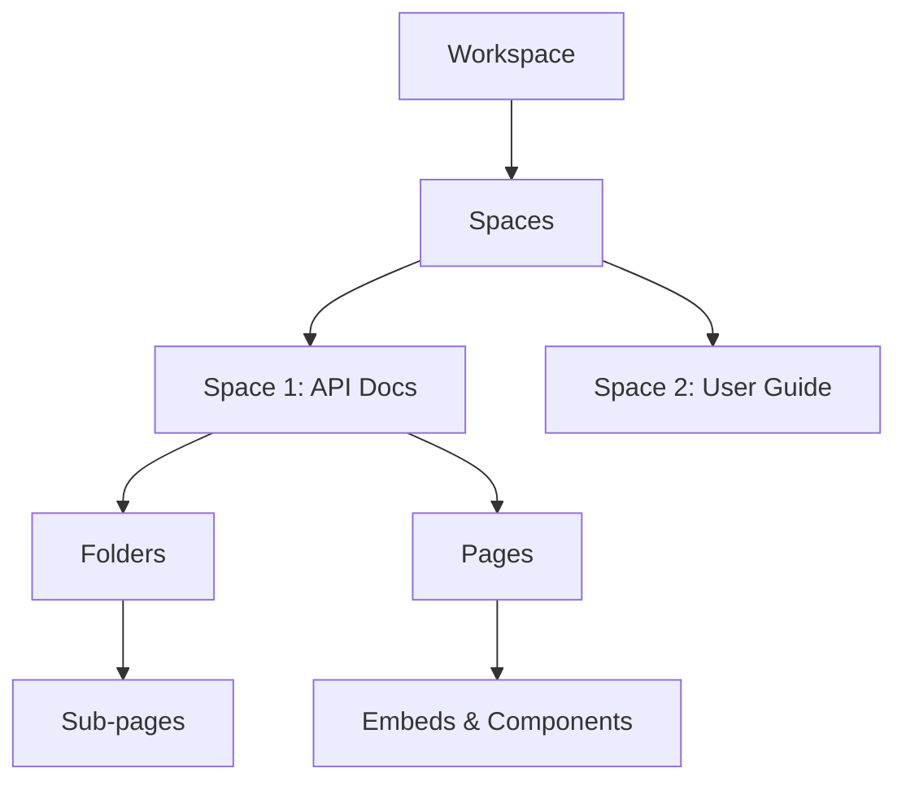

<Callout kind="info" title="Starter Kit Template">
  This documentation was generated as a starter kit template based on your brand. Please review and customize the content to accurately reflect your product's features, APIs, and capabilities.
</Callout>

## Overview

LinkSpot empowers teams to create, organize, and maintain comprehensive documentation spaces for their projects. You can build structured knowledge bases, collaborate in real-time, and integrate with your favorite tools without the hassle of complex setups. Whether documenting APIs, user guides, or internal wikis, LinkSpot streamlines the process so you focus on content rather than tools.

Key benefits include intuitive navigation, version control for docs, and seamless search across your entire space. Start small and scale to enterprise-level documentation effortlessly.

## Key Features

<Columns cols={3}>

<Card title="Organized Spaces" icon="book-open" href="#quick-start">

  Create unlimited documentation spaces with folders, pages, and subpages. Keep everything structured and easy to find.

</Card>

<Card title="Real-Time Collaboration" icon="users" href="/quickstart">

  Invite team members, edit simultaneously, and track changes with built-in version history.

</Card>

<Card title="Embed & Integrate" icon="zap" href="/authentication">

  Embed code snippets, diagrams, and third-party content. Connect via webhooks or API.

</Card>

<Card title="Advanced Search" icon="search" href="/changelog">

  Full-text search with filters finds any document instantly, even in large spaces.

</Card>

</Columns>

## Quick Start

Get up and running in minutes with these steps.

<Steps>

<Step title="Create Your Account" icon="user-plus">

  Sign up at `https://app.linkspot.com/register` using your email or GitHub account.

</Step>

<Step title="Set Up a Space" icon="folder-plus">

  Create a new documentation space for your project. Name it and add a description.

  ```bash
  # Example space configuration via CLI (optional)
  linkspot space create my-project --description "Project docs"
  ```

</Step>

<Step title="Add Your First Page" icon="plus">

  Click "New Page" and start writing. Use markdown, embeds, or import from Markdown files.

  <CodeGroup tabs="Markdown,HTML">

  ```markdown
  # Welcome to My Project
  This is your first documentation page.
  ```

  ```html
  <h1>Welcome to My Project</h1>
  <p>This is your first documentation page.</p>
  ```

  </CodeGroup>

</Step>

<Step title="Invite Collaborators" icon="share-2">

  Share your space link or add users via email. Set permissions for edit or view access.

</Step>

</Steps>

## Who Should Use LinkSpot

LinkSpot suits various roles and teams.

<Tabs>

<Tab title="Developers" icon="code">

  Document APIs, SDKs, and deployment guides. Embed code examples and auto-sync with repos.

</Tab>

<Tab title="Product Managers" icon="package">

  Centralize roadmaps, user stories, and release notes. Collaborate without context switching.

</Tab>

<Tab title="Engineering Teams" icon="users">

  Build internal wikis for onboarding, architecture, and troubleshooting.

</Tab>

</Tabs>

## Basic Architecture

LinkSpot uses a hierarchical structure for your documentation.



<Expandable title="Advanced Customization" default-open="false">

  Customize your space with themes, custom domains, and webhooks. Configure via the settings panel:

  ```json
  {
    "theme": "blue",
    "domain": "docs.mycompany.com",
    "webhook": "https://your-webhook-url.com/webhook"
  }
  ```

</Expandable>

## Next Steps

<Callout kind="tip">
  Explore the [Quickstart](/quickstart) guide next to build your first full documentation space.
</Callout>

<Card title="Quickstart Guide" icon="rocket" href="/quickstart" horizontal>

  Dive deeper into setup and best practices.

</Card>

<Card title="Authentication" icon="lock" href="/authentication" horizontal>

  Learn how to secure your spaces.

</Card>