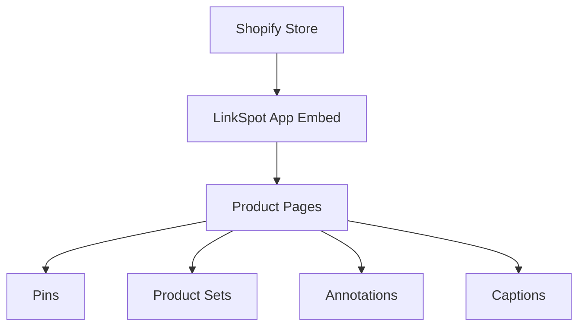

## Overview

LinkSpot turns product images into interactive sales assets, using shoppable elements for cross-selling and visual overlays to explain product features directly on the image.

Add clickable hotspots, curated product groups, text callouts, and captions to any product gallery image -- all without editing your theme code. LinkSpot works through a theme app embed that integrates seamlessly with your Shopify storefront.

## Key Features

<Columns cols={2}>

<Card title="Pins" icon="map-pin" href="/features#pins">

  Clickable hotspots placed on product images that link to other products. Choose from 12 styles and display product info on click or hover.

</Card>

<Card title="Product Sets" icon="package" href="/features#product-sets">

  Curated product groups displayed on product images. Three layout options: Button & Popup, Card Carousel, and Links List.

</Card>

<Card title="Annotations" icon="message-square" href="/features#annotations">

  Text overlays on product images to highlight features, materials, or details with customizable transitions and color schemes.

</Card>

<Card title="Captions" icon="type" href="/features#captions">

  Caption overlays on product images with configurable size and corner positioning.

</Card>

</Columns>

## Quick Start

Get up and running in minutes with these steps.

<Steps>

<Step title="Install LinkSpot" icon="download">

  Install LinkSpot from the Shopify App Store. Approve the required permissions when prompted.

</Step>

<Step title="Enable the App Embed Block" icon="toggle-right">

  Open your theme editor and enable the LinkSpot app embed block, then save. This allows LinkSpot to load on your storefront.

</Step>

<Step title="Run Compatibility Test" icon="check-circle">

  From the LinkSpot dashboard, run the compatibility test to verify your theme works with LinkSpot. The test detects your product image gallery automatically.

</Step>

<Step title="Create Your First Element" icon="plus">

  Create a Pin, Product Set, Annotation, or Caption and preview it on your storefront.

</Step>

</Steps>

## Use Cases

<Tabs>

<Tab title="Cross-Selling" icon="package">

  Use **Product Sets** to show complementary products directly on product images. Display outfit components, accessories, or related items customers can add to cart without leaving the page.

</Tab>

<Tab title="Product Hotspots" icon="map-pin">

  Place **Pins** on product images to link to other products in the photo. Ideal for lifestyle shots, room scenes, or group photos where multiple products are visible.

</Tab>

<Tab title="Feature Callouts" icon="message-square">

  Add **Annotations** and **Captions** to highlight materials, dimensions, unique features, or care instructions directly on the product image.

</Tab>

</Tabs>

## How It Works

LinkSpot uses a Shopify theme app embed to render interactive elements on your product pages.

<Expandable title="Technical Details" default-open="false">

  LinkSpot stores element data in Shopify metafields (`linkspot.pins_data`, `linkspot.annotations_data`, `linkspot.captions_data`, `linkspot.product_sets`). The app embed block reads these metafields and renders the interactive elements on the product gallery images. No theme code modifications are required.

</Expandable>

## Next Steps

<Card title="Quickstart Guide" icon="rocket" href="/quickstart" horizontal>

  Step-by-step setup instructions to get LinkSpot running on your store.

</Card>

<Card title="Features" icon="layers" href="/features" horizontal>

  Detailed overview of Pins, Product Sets, Annotations, and Captions.

</Card>
